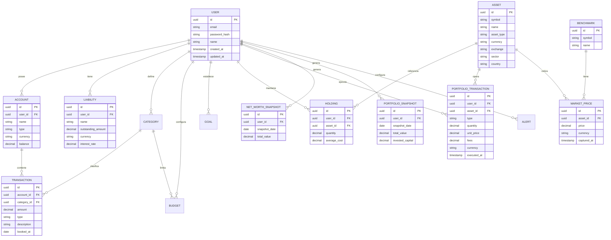

# FinTrack — Personal Wealth & Portfolio Management Platform

> Aplicación full-stack para centralizar patrimonio, cuentas, efectivo, inversiones y criptomonedas en un único panel, con análisis de cartera, rentabilidad, cash flow y evolución histórica del patrimonio.

**Estado del proyecto:** Fase de diseño  
**Stack principal:** Java 21 · Spring Boot · MySQL · React · TypeScript

---

## Índice

1. [Resumen del proyecto](#1-resumen-del-proyecto)
2. [Objetivos](#2-objetivos)
3. [Alcance funcional](#3-alcance-funcional)
4. [Arquitectura](#4-arquitectura)
5. [Stack tecnológico](#5-stack-tecnológico)
6. [Backend](#6-backend)
7. [Frontend](#7-frontend)
8. [Modelo de datos](#8-modelo-de-datos)
9. [Diseño de la API REST](#9-diseño-de-la-api-rest)
10. [Seguridad](#10-seguridad)
11. [Testing y calidad](#11-testing-y-calidad)
12. [Infraestructura y DevOps](#12-infraestructura-y-devops)
13. [Roadmap por fases](#13-roadmap-por-fases)
14. [Estructura del repositorio](#14-estructura-del-repositorio)
15. [Puesta en marcha](#15-puesta-en-marcha)
16. [Decisiones de diseño](#16-decisiones-de-diseño)
17. [Evolución futura](#17-evolución-futura)

---

## 1. Resumen del proyecto

**FinTrack** es una plataforma de gestión patrimonial y análisis financiero personal. Su objetivo no es únicamente registrar gastos, sino proporcionar una visión consolidada del patrimonio del usuario: efectivo, cuentas, inversiones, criptomonedas y, posteriormente, deudas.

El producto se estructura alrededor de tres pilares:

- **Wealth:** patrimonio neto, cuentas, efectivo, deudas y objetivos financieros.
- **Portfolio:** activos, operaciones, posiciones, dividendos, rentabilidad y composición de cartera.
- **Analytics:** evolución patrimonial, performance, asignación de activos, exposición por divisa/sector/geografía y comparación con benchmarks.

El módulo de **Cash Flow** complementa estos pilares mediante ingresos, gastos, categorías, presupuestos e importación de movimientos.

FinTrack no incluye funcionalidades sociales como feeds, seguidores, likes, comentarios o perfiles públicos. El objetivo es ofrecer una experiencia centrada en los datos financieros privados del usuario.

El proyecto está pensado con doble propósito:

- **Producto:** una herramienta útil para analizar y controlar patrimonio y cartera.
- **Portfolio técnico:** un sistema con complejidad backend real: modelado de dominio, cálculos financieros, consultas analíticas, seguridad, integraciones externas, testing, caché y CI/CD.

---

## 2. Objetivos

### Objetivos de producto

- Centralizar en un único lugar la situación patrimonial del usuario.
- Mostrar el patrimonio neto y su evolución histórica.
- Gestionar cuentas, efectivo y obligaciones financieras.
- Registrar operaciones de inversión y reconstruir posiciones.
- Mostrar valoración y rentabilidad de la cartera.
- Analizar distribución por activo, sector, geografía y divisa.
- Comparar el rendimiento de la cartera con benchmarks.
- Controlar ingresos, gastos, cash flow y presupuestos.
- Permitir incorporación rápida de datos mediante CSV.

### Objetivos técnicos

- Construir una API REST versionada y documentada con **Spring Boot**.
- Aplicar una arquitectura modular basada en dominio y separación clara de responsabilidades.
- Implementar autenticación y autorización con **JWT** y **Spring Security**.
- Utilizar **MySQL** como base de datos relacional principal.
- Aplicar consultas SQL eficientes para agregaciones financieras y analíticas.
- Integrar APIs externas de datos de mercado mediante una abstracción `MarketDataProvider`.
- Implementar caché con Redis para datos externos y operaciones costosas.
- Cubrir la lógica financiera con tests unitarios y de integración.
- Contenerizar la aplicación y automatizar build, test y despliegue mediante CI/CD.

### Objetivos de aprendizaje

- Comprender Spring Boot desde un proyecto real de extremo a extremo.
- Entender persistencia relacional con JPA/Hibernate y MySQL.
- Diseñar APIs REST y modelos de dominio mantenibles.
- Comprender cálculos de portfolio y métricas financieras.
- Entender cada decisión de diseño, no solo implementarla.
- Utilizar IA como herramienta de apoyo al desarrollo manteniendo criterio sobre la arquitectura y el código.

---

## 3. Alcance funcional

### 3.1 Funcionalidades principales — MVP

| Módulo | Descripción |
|---|---|
| **Autenticación** | Registro, login, refresh de tokens y gestión del perfil. |
| **Dashboard** | Patrimonio neto, valor de cartera, efectivo, cash flow y principales métricas. |
| **Wealth** | Cuentas, efectivo, deudas y visión consolidada del patrimonio. |
| **Cash Flow** | Ingresos, gastos, transferencias, categorías y filtros. |
| **Portfolio** | Activos, operaciones y posiciones de inversión. |
| **Analytics** | Evolución patrimonial, rentabilidad y composición de cartera. |

### 3.2 Funcionalidades de gestión financiera

| Módulo | Descripción |
|---|---|
| **Cuentas** | Cuentas bancarias, efectivo y tarjetas, con saldo y divisa. |
| **Transacciones** | Ingresos, gastos y transferencias entre cuentas. |
| **Categorías** | Categorías por defecto y personalizadas. |
| **Presupuestos** | Límite periódico por categoría y seguimiento del consumo. |
| **Objetivos** | Metas financieras con importe objetivo, fecha y progreso. |
| **Importación CSV** | Carga masiva de movimientos con mapeo, validación y detección de duplicados. |

### 3.3 Funcionalidades de portfolio

| Módulo | Descripción |
|---|---|
| **Assets** | Acciones, ETFs, fondos, criptomonedas y otros activos soportados. |
| **Operaciones** | Compras, ventas, dividendos, comisiones, depósitos y retiradas. |
| **Holdings** | Posiciones actuales calculadas a partir de las operaciones. |
| **Market Data** | Precios de mercado mediante proveedores externos. |
| **Performance** | Valor actual, capital invertido, P&L realizado/no realizado y rentabilidad. |
| **Allocation** | Distribución por tipo de activo, sector, geografía y divisa. |
| **Benchmarks** | Comparación histórica de la cartera con índices o referencias configuradas. |

### 3.4 Analytics avanzado

- Evolución del patrimonio.
- Evolución del valor de la cartera.
- Rentabilidad absoluta y porcentual.
- P&L realizado y no realizado.
- Cash flow por periodo.
- Tasa de ahorro.
- Asignación de activos.
- Exposición por sector, país/geografía y divisa.
- Dividendos y comisiones.
- Drawdown y volatilidad cuando exista suficiente histórico.
- Comparación con benchmarks.
- Snapshots históricos para evitar recalcular todo el pasado.

### 3.5 Fuera de alcance inicial

- Feed social.
- Seguidores, likes, comentarios o perfiles públicos.
- Conexión directa con bancos mediante Open Banking / PSD2.
- Aplicación móvil nativa.
- Finanzas compartidas de pareja/familia.
- Trading real o ejecución de órdenes.

---

## 4. Arquitectura

### 4.1 Arquitectura inicial

```text
                  ┌──────────────────┐
                  │      React       │
                  │   TypeScript     │
                  └────────┬─────────┘
                           │
                         REST API
                           │
                  ┌────────▼─────────┐
                  │   Spring Boot    │
                  │                  │
                  │ Auth             │
                  │ Wealth           │
                  │ CashFlow         │
                  │ Portfolio        │
                  │ Analytics        │
                  │ MarketData       │
                  └────────┬─────────┘
                           │
                     JPA / Hibernate
                           │
                  ┌────────▼─────────┐
                  │      MySQL       │
                  └──────────────────┘
```

El frontend SPA consume una API REST stateless. El backend concentra la lógica de negocio y persiste los datos mediante JPA/Hibernate sobre MySQL.

### 4.2 Arquitectura objetivo

```text
                         ┌──────────────┐
                         │    React     │
                         └──────┬───────┘
                                │
                              REST
                                │
                         ┌──────▼───────┐
                         │  Spring Boot │
                         └──────┬───────┘
                                │
              ┌─────────────────┼──────────────────┐
              │                 │                  │
              ▼                 ▼                  ▼
           MySQL              Redis          External APIs
              │                 │                  │
              │                 │             Market Data
              │                 │
              └─────────► Analytics ◄──────────────┘
```

- **MySQL:** persistencia relacional principal.
- **Redis:** caché de precios, datos externos y resultados costosos.
- **APIs externas:** cotizaciones y metadatos de activos.
- **Analytics:** servicios de dominio encargados de cálculos de patrimonio, portfolio y métricas.

### 4.3 Arquitectura por capas

```text
┌─────────────────────────────────────────────┐
│ Controller (REST)                           │ ← HTTP, validación, DTOs
├─────────────────────────────────────────────┤
│ Service / Domain                             │ ← Reglas de negocio
├─────────────────────────────────────────────┤
│ Repository                                  │ ← Persistencia
├─────────────────────────────────────────────┤
│ Domain / Entities                           │ ← Modelo de dominio
└─────────────────────────────────────────────┘
```

Principios:

- Los controllers no contienen lógica de negocio.
- Las entidades JPA no se exponen directamente.
- La API utiliza DTOs.
- La lógica transaccional vive en servicios.
- Los cálculos financieros deben ser deterministas y testeables.
- El acceso a datos se encapsula en repositories.
- Las integraciones externas se aíslan mediante interfaces.
- La lógica de negocio no debe depender directamente del proveedor de market data.

### 4.4 Flujo de una petición

```text
Cliente
   │
   ▼
JWT Filter
   │
   ▼
Controller
   │
   ▼
Service / Domain
   │
   ├──────────────► Repository ─────► MySQL
   │
   ├──────────────► Redis
   │
   └──────────────► MarketDataProvider ─────► External API
```

---

## 5. Stack tecnológico

### Frontend

| Tecnología | Uso |
|---|---|
| **React** | UI basada en componentes. |
| **TypeScript** | Tipado estático y contratos con la API. |
| **Tailwind CSS** | Diseño consistente y responsive. |
| **Recharts** | Visualización de métricas financieras. |
| **TanStack Query** | Estado de servidor, fetching y caché. |

### Backend

| Tecnología | Uso |
|---|---|
| **Java 21** | Lenguaje principal. |
| **Spring Boot** | Framework de backend. |
| **Spring Security** | Autenticación y autorización. |
| **Spring Data JPA** | Persistencia. |
| **Hibernate** | ORM. |
| **REST** | API. |
| **OpenAPI / Swagger** | Documentación interactiva. |

### Base de datos

| Tecnología | Uso |
|---|---|
| **MySQL 8+** | Base de datos relacional principal. |
| **Flyway** | Migraciones versionadas del esquema. |

### Infraestructura

| Tecnología | Uso |
|---|---|
| **Redis** | Caché. |
| **Docker** | Contenerización. |
| **GitHub Actions** | CI/CD. |
| **Cloud** | Despliegue de la aplicación. |

---

## 6. Backend

### 6.1 Módulos

```text
Auth              → registro, login, tokens, perfil
Wealth            → patrimonio, cuentas, efectivo y deudas
CashFlow          → ingresos, gastos, transferencias
Categories        → categorías y etiquetas
Budgets           → presupuestos
Goals             → objetivos financieros
Portfolio         → assets, operaciones y holdings
Analytics         → métricas y agregaciones
MarketData        → proveedores de cotizaciones
Alerts            → reglas y notificaciones
Common            → configuración, errores y utilidades
```

### 6.2 Patrimonio neto

```text
Patrimonio neto =
    Σ efectivo y saldos de cuentas
  + Σ valor de mercado de holdings
  − Σ deudas
```

El valor de mercado de un holding se calcula como:

```text
Valor de posición = cantidad × precio actual
```

Los snapshots históricos permiten representar la evolución patrimonial sin tener que reconstruir todo el estado histórico en cada consulta.

### 6.3 Portfolio Analytics Engine

El motor de analítica de cartera será uno de los componentes técnicos principales del proyecto.

Debe poder calcular:

- Capital invertido.
- Valor actual.
- P&L realizado.
- P&L no realizado.
- Rentabilidad porcentual.
- Coste medio.
- Peso de cada posición.
- Asset allocation.
- Exposición por sector.
- Exposición geográfica.
- Exposición por divisa.
- Dividendos.
- Comisiones.
- Benchmark comparison.
- Drawdown y volatilidad cuando exista histórico suficiente.

La lógica de cálculo debe estar desacoplada de la capa REST para poder probarla de forma aislada.

### 6.4 Reconstrucción de holdings

En lugar de almacenar únicamente una posición final, FinTrack registra operaciones:

```text
BUY
SELL
DIVIDEND
FEE
DEPOSIT
WITHDRAWAL
SPLIT
```

A partir de estas operaciones el sistema puede reconstruir la posición del usuario y calcular el coste acumulado.

Esto permite mantener un historial de portfolio más fiable y habilita futuras métricas de performance.

### 6.5 Agregaciones

Consultas y servicios analíticos:

- Gasto por categoría y periodo.
- Ingresos vs. gastos.
- Cash flow mensual.
- Tasa de ahorro.
- Evolución del patrimonio.
- Evolución de la cartera.
- Distribución de activos.
- P&L por activo.
- P&L global.
- Dividendos.
- Comisiones.
- Exposición por divisa, sector y geografía.

### 6.6 Importación CSV

Flujo:

1. El usuario sube un CSV.
2. Se detectan columnas.
3. El usuario realiza el mapping.
4. Se validan las filas.
5. Se detectan duplicados.
6. Se muestra una previsualización.
7. El usuario confirma.
8. Los datos se persisten de forma transaccional.

El mismo mecanismo podrá evolucionar posteriormente para importar movimientos de inversión.

### 6.7 Market Data

- Cliente HTTP dedicado mediante `RestClient` / `WebClient`.
- Abstracción `MarketDataProvider`.
- Caché con Redis.
- Control de rate limits.
- Fallback ante errores del proveedor.
- Separación entre datos persistidos del activo y precios de mercado dinámicos.

### 6.8 Manejo de errores

- `@RestControllerAdvice`.
- Error response consistente.
- Bean Validation.
- Códigos HTTP apropiados.
- Logs estructurados.
- Correlation/request ID como mejora de observabilidad.

---

## 7. Frontend

### 7.1 Pantallas principales

| Pantalla | Contenido |
|---|---|
| **Login / Registro** | Autenticación. |
| **Dashboard** | Vista consolidada del patrimonio y cartera. |
| **Portfolio** | Posiciones, valoración, rentabilidad y allocation. |
| **Asset Detail** | Información, operaciones y performance de un activo. |
| **Transactions** | Ingresos, gastos y transferencias. |
| **Accounts** | Cuentas, efectivo y movimientos. |
| **Cash Flow** | Evolución de ingresos y gastos. |
| **Analytics** | Métricas y análisis histórico. |
| **Budgets** | Presupuestos y consumo. |
| **Goals** | Objetivos financieros. |
| **Import** | Asistente CSV. |
| **Settings** | Perfil, categorías y preferencias. |

### 7.2 Dashboard

El dashboard debe priorizar la visión patrimonial:

```text
┌────────────────────────────────────────────────────┐
│ Net Worth                         €18,420          │
│ +8.4%                                            │
├─────────────────────┬──────────────────────────────┤
│ Portfolio           │ Cash                         │
│ €13,220             │ €5,200                       │
├─────────────────────┴──────────────────────────────┤
│                                                    │
│              Net Worth History                     │
│                  📈                                │
│                                                    │
├──────────────────────────┬─────────────────────────┤
│ Portfolio Allocation     │ Performance              │
│ Stocks       45%         │ Portfolio   +8.4%      │
│ ETFs         35%         │ Benchmark   +7.1%      │
│ Crypto       10%         │                         │
│ Cash         10%         │                         │
├──────────────────────────┴─────────────────────────┤
│ Cash Flow                                          │
│ Income       €2,400                                │
│ Expenses     €1,650                                │
│ Savings       €750                                 │
└────────────────────────────────────────────────────┘
```

### 7.3 Portfolio

Vista dedicada con:

- Valor total.
- Capital invertido.
- P&L.
- Rentabilidad.
- Holdings.
- Allocation.
- Performance histórica.
- Dividendos.
- Comisiones.
- Benchmark.

### 7.4 Organización del frontend

- Componentes reutilizables.
- Organización por features.
- Servicios para llamadas API.
- Tipos TypeScript alineados con OpenAPI.
- TanStack Query para estado de servidor.
- Rutas protegidas.
- Diseño responsive.

---

## 8. Modelo de datos

### 8.1 Entidades principales

| Entidad | Descripción |
|---|---|
| `User` | Usuario. |
| `Account` | Cuenta bancaria, efectivo o tarjeta. |
| `Liability` | Deuda u obligación financiera. |
| `Category` | Categoría de ingresos/gastos. |
| `Transaction` | Movimiento de cash flow. |
| `Budget` | Presupuesto. |
| `Goal` | Objetivo financiero. |
| `Asset` | Activo financiero. |
| `PortfolioTransaction` | Operación sobre un activo. |
| `Holding` | Posición consolidada del usuario. |
| `MarketPrice` | Precio histórico de un activo. |
| `NetWorthSnapshot` | Snapshot del patrimonio. |
| `PortfolioSnapshot` | Snapshot de la cartera. |
| `Benchmark` | Índice o referencia de comparación. |
| `Alert` | Regla de alerta. |

### 8.2 Diagrama entidad-relación



### 8.3 Consideraciones de diseño

- Importes monetarios: `DECIMAL` en MySQL y `BigDecimal` en Java.
- UUID como identificadores públicos.
- Índices sobre claves de usuario y fechas.
- Índices sobre `(asset_id, captured_at)` para precios históricos.
- Índices sobre `(user_id, executed_at)` para operaciones.
- Restricciones de integridad referencial.
- `created_at` y `updated_at` para auditoría básica.
- Borrado lógico donde sea necesario conservar histórico.
- La posición actual debe poder reconstruirse desde las operaciones.

---

## 9. Diseño de la API REST

Base URL: `/api/v1`

### Autenticación

| Método | Endpoint | Descripción |
|---|---|---|
| POST | `/auth/register` | Registro. |
| POST | `/auth/login` | Login. |
| POST | `/auth/refresh` | Refresh token. |
| GET | `/users/me` | Perfil autenticado. |

### Wealth

| Método | Endpoint | Descripción |
|---|---|---|
| GET | `/wealth/summary` | Resumen patrimonial. |
| GET | `/wealth/net-worth` | Patrimonio neto actual. |
| GET | `/wealth/history` | Evolución histórica. |
| GET | `/accounts` | Listar cuentas. |
| POST | `/accounts` | Crear cuenta. |
| PUT | `/accounts/{id}` | Actualizar cuenta. |
| DELETE | `/accounts/{id}` | Eliminar cuenta. |
| GET | `/liabilities` | Listar deudas. |

### Cash Flow

| Método | Endpoint | Descripción |
|---|---|---|
| GET | `/transactions` | Listar con filtros/paginación. |
| POST | `/transactions` | Crear movimiento. |
| PUT | `/transactions/{id}` | Actualizar movimiento. |
| DELETE | `/transactions/{id}` | Eliminar movimiento. |
| POST | `/transactions/import` | Importar CSV. |

### Portfolio

| Método | Endpoint | Descripción |
|---|---|---|
| GET | `/portfolio/summary` | Resumen de cartera. |
| GET | `/portfolio/holdings` | Posiciones actuales. |
| GET | `/portfolio/transactions` | Operaciones. |
| POST | `/portfolio/transactions` | Registrar operación. |
| GET | `/portfolio/performance` | Performance global. |
| GET | `/portfolio/allocation` | Distribución de cartera. |
| GET | `/portfolio/dividends` | Dividendos. |
| GET | `/portfolio/{assetId}` | Detalle de activo. |

### Analytics

| Método | Endpoint | Descripción |
|---|---|---|
| GET | `/analytics/net-worth` | Patrimonio actual. |
| GET | `/analytics/net-worth/history` | Evolución patrimonial. |
| GET | `/analytics/performance` | Rentabilidad histórica. |
| GET | `/analytics/cashflow` | Cash flow. |
| GET | `/analytics/spending-by-category` | Gasto por categoría. |
| GET | `/analytics/allocation` | Asset allocation. |
| GET | `/analytics/benchmark` | Comparación con benchmark. |

La documentación completa se expone mediante **OpenAPI/Swagger**.

---

## 10. Seguridad

- Autenticación con JWT.
- Access token de corta duración + refresh token.
- Contraseñas almacenadas mediante BCrypt.
- Autorización a nivel de recurso.
- Cada usuario solo puede acceder a sus propios datos.
- CORS restrictivo.
- Validación de entrada.
- Secretos fuera del código mediante variables de entorno.
- Rate limiting en endpoints sensibles como mejora posterior.
- No almacenar API keys ni credenciales en el repositorio.
- Logs sin información financiera sensible.

---

## 11. Testing y calidad

| Nivel | Herramientas | Alcance |
|---|---|---|
| **Unitario** | JUnit 5, Mockito | Servicios, reglas y cálculos financieros. |
| **Integración** | Spring Boot Test, Testcontainers | MySQL real, repositorios y servicios. |
| **API** | MockMvc / REST Assured | Endpoints, contratos y códigos HTTP. |
| **Frontend** | Vitest, React Testing Library | Componentes y flujos clave. |
| **Calidad** | SonarCloud / Checkstyle | Análisis estático y cobertura. |

Se priorizarán especialmente:

- Cálculo de patrimonio.
- Reconstrucción de holdings.
- P&L.
- Rentabilidad.
- Allocation.
- Cash flow.
- Presupuestos.

Los cálculos financieros deben disponer de casos de prueba con operaciones de compra, venta, comisiones, dividendos y múltiples activos.

---

## 12. Infraestructura y DevOps

### 12.1 Contenerización

- Dockerfile multi-stage para backend.
- Dockerfile para frontend.
- `docker-compose.yml` para API, frontend, MySQL y Redis.
- Persistencia de datos de MySQL mediante volumen Docker.

### 12.2 CI/CD

```text
push / pull request
        │
        ▼
    ┌─────────┐
    │  Build  │
    └────┬────┘
         ▼
    ┌─────────┐
    │  Tests  │
    └────┬────┘
         ▼
 ┌──────────────┐
 │ Docker image │
 └──────┬───────┘
        ▼
    ┌─────────┐
    │ Deploy  │
    └─────────┘
```

- Pull requests: build + tests.
- Main: build de imágenes y despliegue.
- Migraciones Flyway ejecutadas de forma controlada durante el despliegue.

### 12.3 Entornos

| Entorno | Propósito |
|---|---|
| `local` | Desarrollo con Docker Compose. |
| `staging` | Validación previa a producción. |
| `production` | Despliegue público. |

Configuración mediante Spring Profiles y variables de entorno.

---

## 13. Roadmap por fases

### Fase 0 — Diseño

- Definición funcional.
- Arquitectura.
- Modelo de datos.
- Diagrama ER.
- Contrato API.
- Configuración del repositorio.

### Fase 1 — Backend foundation

- Spring Boot.
- MySQL.
- Flyway.
- Seguridad JWT.
- Estructura package-by-feature.
- OpenAPI.
- Manejo global de errores.
- Tests iniciales.

### Fase 2 — Wealth & Cash Flow

- Usuarios.
- Cuentas.
- Deudas.
- Categorías.
- Transacciones.
- Cash flow.
- Presupuestos.

### Fase 3 — Portfolio Core

- Assets.
- Portfolio transactions.
- Holdings.
- Compras y ventas.
- Coste medio.
- Valoración.

### Fase 4 — Market Data

- Integración con proveedor externo.
- Precios históricos.
- Caché Redis.
- Rate limiting.
- Fallback.

### Fase 5 — Portfolio Analytics

- P&L.
- Performance.
- Allocation.
- Dividendos.
- Comisiones.
- Benchmarks.
- Snapshots de cartera.

### Fase 6 — Dashboard & UX

- Dashboard patrimonial.
- Portfolio dashboard.
- Charts.
- Filtros.
- Responsive UI.
- UX polishing.

### Fase 7 — Importación y robustez

- Importación CSV.
- Detección de duplicados.
- Validaciones.
- Testcontainers.
- Tests de escenarios financieros.

### Fase 8 — DevOps

- Docker.
- GitHub Actions.
- CI/CD.
- Observabilidad.
- Cloud deployment.

### Fase 9 — Features avanzadas

- Multidivisa.
- Open Banking.
- Alertas.
- Suscripciones recurrentes.
- Exportación PDF/Excel.
- PWA.
- Asistente IA.

---

## 14. Estructura del repositorio

```text
fintrack/
├── backend/
│   ├── src/main/java/com/fintrack/
│   │   ├── auth/
│   │   ├── wealth/
│   │   ├── account/
│   │   ├── liability/
│   │   ├── transaction/
│   │   ├── category/
│   │   ├── budget/
│   │   ├── goal/
│   │   ├── portfolio/
│   │   ├── asset/
│   │   ├── marketdata/
│   │   ├── analytics/
│   │   ├── alert/
│   │   └── common/
│   ├── src/main/resources/
│   │   ├── application.yml
│   │   └── db/migration/
│   ├── src/test/
│   ├── Dockerfile
│   └── pom.xml
│
├── frontend/
│   ├── src/
│   │   ├── features/
│   │   │   ├── auth/
│   │   │   ├── dashboard/
│   │   │   ├── wealth/
│   │   │   ├── cashflow/
│   │   │   ├── portfolio/
│   │   │   └── analytics/
│   │   ├── components/
│   │   ├── services/
│   │   ├── hooks/
│   │   ├── types/
│   │   └── main.tsx
│   ├── Dockerfile
│   └── package.json
│
├── docs/
│   ├── architecture.md
│   ├── data-model.md
│   └── api.md
│
├── .github/workflows/
│   └── ci.yml
├── docker-compose.yml
└── README.md
```

El backend se organiza por **dominio (package-by-feature)** y el frontend por **features**, manteniendo cohesión y límites claros.

---

## 15. Puesta en marcha

### Requisitos

- Java 21.
- Node.js 20+.
- Docker y Docker Compose.

### Ejecución con Docker

```bash
git clone https://github.com/<usuario>/fintrack.git
cd fintrack
docker compose up --build
```

- Frontend: `http://localhost:5173`
- API: `http://localhost:8080`
- Swagger UI: `http://localhost:8080/swagger-ui`

### Ejecución en desarrollo

```bash
# Base de datos + Redis
docker compose up -d mysql redis

# Backend
cd backend
./mvnw spring-boot:run

# Frontend
cd frontend
npm install
npm run dev
```

Flyway gestionará las migraciones de MySQL durante el arranque de la aplicación.

---

## 16. Decisiones de diseño

| Decisión | Motivo |
|---|---|
| **Spring Boot** | Ecosistema maduro para backend Java y arquitectura REST. |
| **MySQL** | Base relacional ampliamente utilizada y adecuada para el modelo transaccional del proyecto. |
| **API REST stateless + JWT** | Desacoplamiento frontend/backend y posibilidad de escalar horizontalmente. |
| **DTOs en la frontera** | Evita exponer directamente el modelo de persistencia. |
| **BigDecimal para dinero** | Evita errores de precisión de punto flotante. |
| **Portfolio transactions** | Permite reconstruir holdings y calcular métricas históricas. |
| **Snapshots** | Permiten consultar evolución histórica de patrimonio y cartera eficientemente. |
| **MarketDataProvider** | Aísla la lógica de negocio del proveedor externo. |
| **Redis** | Reduce llamadas externas y permite cachear cálculos costosos. |
| **Testcontainers** | Pruebas de integración contra una instancia real de MySQL. |
| **Package-by-feature** | Mayor cohesión y límites de dominio más claros. |

---

## 17. Evolución futura

- Open Banking / PSD2.
- Soporte multidivisa con FX.
- Más clases de activos.
- Importación de brokers mediante CSV/API.
- Métricas avanzadas de performance.
- Benchmarking configurable.
- Detección de suscripciones recurrentes.
- Alertas de portfolio.
- Informes exportables.
- PWA / aplicación móvil.
- Asistente conversacional con IA.
- Event-driven architecture para procesos asíncronos si la complejidad del producto lo justifica.

---

## Licencia

Por definir (por ejemplo, MIT).

## Autor

Proyecto desarrollado como plataforma de aprendizaje y portfolio profesional en el ecosistema **Java / Spring Boot**, con foco en arquitectura backend, persistencia, APIs REST, analítica financiera, testing y DevOps.
